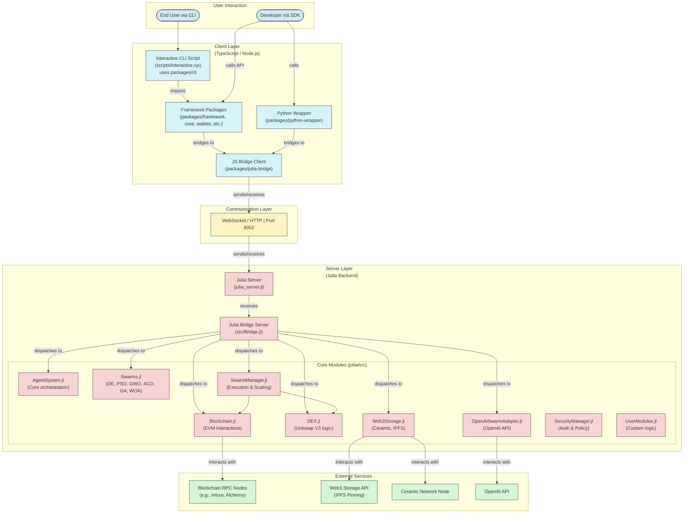

# JuliaOS Open Source AI Agent & Swarm Framework


*joo-LEE-uh-oh-ESS* /ˈdʒuː.li.ə.oʊ.ɛs/

**Noun**
**A powerful multi-chain, community-driven framework for AI and Swarm technological innovation, powered by Julia.**


## Overview

JuliaOS is a comprehensive framework for building decentralized applications (DApps) with a focus on agent-based architectures, swarm intelligence, and cross-chain operations. It provides both a CLI interface for quick deployment and a framework API for custom implementations. By leveraging AI-powered agents and swarm optimization, JuliaOS enables sophisticated strategies across multiple blockchains.

## Documentation

- 📖 [Overview](./docs/gitbook/technical/features/README.md): Project overview and vision
- 🤝 [Partners](./docs/gitbook/technical/features/agents.md): Partners & Ecosystems
  
### Technical

- 🚀 [Getting Started](./docs/gitbook/technical/features/agents.md): Quick start guide
- 🏗️ [Architecture](./docs/gitbook/technical/features/swarms.md): Architecture overview
- 🧑‍💻 [Developer Hub](./docs/gitbook/technical/features/agents.md): For the developer
    
### Features

- 🌟 [Core Features & Concepts](./docs/gitbook/technical/features/swarms.md): Important features and fundamentals
- 🤖 [Agents](./docs/gitbook/technical/features/swarms.md): Everything about Agents
- 🐝 [Swarms](./docs/gitbook/technical/features/agents.md): Everything about Swarms
- 🧠 [Neural Networks](./docs/gitbook/technical/features/swarms.md): Everything about Neural Networks
- ⛓️ [Blockchains](./docs/gitbook/technical/features/agents.md): All blockchains where you can find JuliaOS
- 🌉 [Bridges](./docs/gitbook/technical/features/swarms.md): Important bridge notes and information
- 🔌 [Integrations](./docs/gitbook/technical/features/agents.md): All forms of integrations
- 💾 [Storage](./docs/gitbook/technical/features/swarms.md): Different types of storage
- 👛 [Wallets](./docs/gitbook/technical/features/agents.md): Supported wallets
- 🚩 [Use Cases](./docs/gitbook/technical/features/agents.md): All use cases and examples
- 🔵 [API]([./docs/gitbook/technical/api/julia.md](https://app.gitbook.com/o/exUlED0J6dNbtzZEx1Nf/s/gTJWi5eSEdsS1fPoRXqT/~/changes/19/api-documentation/api-reference)): Julia backend API reference


## Quick Start

### Prerequisites

#### Option 1: Using Docker (Recommended)

The easiest way to get started with JuliaOS is using Docker, which eliminates the need to install dependencies separately:

- [Docker](https://www.docker.com/products/docker-desktop/) (v20.10 or later recommended)
- [Docker Compose](https://docs.docker.com/compose/install/) (v2.0 or later, included with Docker Desktop)

#### Option 2: Manual Installation

If you prefer to install dependencies manually:

- [Node.js](https://nodejs.org/) (v18 or later recommended)
- [npm](https://www.npmjs.com/) (v7 or later, comes with Node.js)
- [Julia](https://julialang.org/downloads/) (v1.10 or later recommended)
- [Python](https://www.python.org/downloads/) (v3.8 or later, optional for Python wrapper)

Make sure `node`, `julia`, and `python` commands are available in your system's PATH.

### Installation and Setup

#### Option 1: Quick Start with Docker (Recommended)

```bash
# Clone the repository
git clone https://github.com/Juliaoscode/JuliaOS.git
cd JuliaOS

# Run JuliaOS using the quick start script
chmod +x run-juliaos.sh
./run-juliaos.sh
```

That's it! This will build and start JuliaOS in Docker containers. The CLI will automatically connect to the Julia server.

#### Option 2: Manual Installation

1.  **Clone the Repository:**
    ```bash
    git clone https://github.com/Juliaoscode/JuliaOS.git
    cd JuliaOS
    ```

2.  **Install Node.js Dependencies:**
    This installs dependencies for the CLI, framework packages, bridge, etc.
    ```bash
    npm install
    ```
    *Troubleshooting: If you encounter errors, ensure you have Node.js v18+ and npm v7+. Deleting `node_modules` and `package-lock.json` before running `npm install` might help.*

3.  **Install Julia Dependencies:**
    This installs the necessary Julia packages for the backend server.
    ```bash
    # Navigate to the julia directory
    cd julia

    # Activate the Julia environment and install packages
    # This might take some time on the first run as it downloads and precompiles packages
    julia -e 'using Pkg; Pkg.activate("."); Pkg.update(); Pkg.instantiate()'

    # Navigate back to the root directory
    cd ..
    ```
    *Troubleshooting: Ensure Julia is installed and in your PATH. If `Pkg.instantiate()` fails, check your internet connection and Julia version compatibility (1.10+). Sometimes running `julia -e 'using Pkg; Pkg.update()'` inside the `julia` directory before `instantiate` can resolve issues.*

4.  **Install Python Dependencies (Optional):**
    If you want to use the Python wrapper, install the necessary Python packages.
    ```bash
    # Option 1: Install directly from GitHub (recommended)
    pip install git+https://github.com/Juliaoscode/JuliaOS.git#subdirectory=packages/python-wrapper

    # Option 2: Install with LLM support
    pip install "git+https://github.com/Juliaoscode/JuliaOS.git@23-04-max-fix#egg=juliaos[llm]&subdirectory=packages/python-wrapper"

    # Option 3: Install with Google ADK support
    pip install "git+https://github.com/Juliaoscode/JuliaOS.git@23-04-max-fix#egg=juliaos[adk]&subdirectory=packages/python-wrapper"

    # Option 4: For development (after cloning the repository)
    cd packages/python-wrapper
    pip install -e .
    cd ../..
    ```
    *Note: The `juliaos` package is NOT available on PyPI. You must install it using one of the methods above.*


    *Troubleshooting Direct GitHub Install (Options 1-3):*
    - Ensure Python 3.8+ and `pip` are installed and in your PATH.
    - Ensure `git` is installed and in your PATH.
    - **Verify the URL format is exactly as shown.** Do not use URLs containing `/tree/`.
    - Use quotes around the URL if your shell requires it (especially for URLs with `[...]` extras).
    - Check your network connection and ensure you can clone the GitHub repository manually.
    - If issues persist, use the **Development Install (Option 4)** below, which is generally more reliable.

    *Troubleshooting Development Install (Option 4):*
    - Ensure you have cloned the `JuliaOS` repository first.
    - Ensure you are running the `pip install -e .` command from within the `packages/python-wrapper` directory.
    - Using a Python virtual environment (`venv` or `conda`) is highly recommended.

5.  **Set Up Environment Variables:**
    Copy the example environment file and add your API keys/RPC URLs for full functionality.
    ```bash
    # Copy the root .env.example (contains keys for Julia backend, Python wrapper tests etc.)
    cp .env.example .env
    nano .env # Add your keys (OpenAI, RPC URLs etc.)

    # Alternatively, copy the example config file for Julia
    cp julia/config.example.toml julia/config.toml
    nano julia/config.toml # Edit with your configuration
    ```

    *Required keys for full functionality:*
    - `OPENAI_API_KEY`: For OpenAI integration
    - `ETHEREUM_RPC_URL`: For Ethereum blockchain interaction (get from [Infura](https://infura.io), [Alchemy](https://www.alchemy.com), or other providers)
    - `POLYGON_RPC_URL`: For Polygon blockchain interaction (get from [Infura](https://infura.io), [Alchemy](https://www.alchemy.com), or other providers)
    - `SOLANA_RPC_URL`: For Solana blockchain interaction (get from [QuickNode](https://www.quicknode.com), [Alchemy](https://www.alchemy.com), or use public endpoints with limitations)
    - `ARBITRUM_RPC_URL`: For Arbitrum blockchain interaction
    - `OPTIMISM_RPC_URL`: For Optimism blockchain interaction
    - `AVALANCHE_RPC_URL`: For Avalanche blockchain interaction
    - `BSC_RPC_URL`: For Binance Smart Chain interaction
    - `BASE_RPC_URL`: For Base blockchain interaction
    - `ARWEAVE_WALLET_FILE`: Path to your Arweave wallet file (for decentralized storage)
    - `ANTHROPIC_API_KEY`: For Claude integration
    - `COHERE_API_KEY`: For Cohere integration
    - `MISTRAL_API_KEY`: For Mistral integration
    - `GOOGLE_API_KEY`: For Gemini integration

    Without these keys, certain functionalities will use mock implementations or have limited capabilities.

    **RPC URL Providers:**
    - **Ethereum/EVM Chains**: [Infura](https://infura.io), [Alchemy](https://www.alchemy.com), [QuickNode](https://www.quicknode.com), [Ankr](https://www.ankr.com)
    - **Solana**: [QuickNode](https://www.quicknode.com), [Alchemy](https://www.alchemy.com), [Helius](https://helius.xyz)

    Most providers offer free tiers that are sufficient for development and testing.

    6. (if not using Docker) Build the project. Run:
    ```bash
    npm run build
    ```

## Local machine deployment and running guide

** Use Git Bash or other Unix-like terminal for Windows users.**


**1. Clone the Repository:**

```bash
git clone --single-branch --branch 23-04-max-fix https://github.com/Juliaoscode/JuliaOS.git
cd JuliaOS
```

**2. Install Node.js Dependencies: This installs dependencies for the CLI, framework packages, bridge, etc.**

```bash
npm install --force
```

**3. Install Julia Dependencies: This installs the necessary Julia packages for the backend server.**

```bash
# Navigate to the julia directory
cd julia

# Activate the Julia environment and install packages
# This might take some time on the first run as it downloads and precompiles packages
julia -e 'using Pkg; Pkg.activate("."); Pkg.update(); Pkg.instantiate()'

# Navigate back to the root directory
cd ..
```

_Troubleshooting: Ensure Julia is installed and in your PATH. If Pkg.instantiate() fails, check your internet connection and Julia version compatibility (1.10+). Sometimes running julia -e 'using Pkg; Pkg.update()' inside the julia directory before instantiate can resolve issues._


**4. Install Python Dependencies (Optional): If you want to use the Python wrapper, install the necessary Python packages.**

```python
# Option 1: Install directly from GitHub (recommended)
pip install git+https://github.com/Juliaoscode/JuliaOS.git#subdirectory=packages/python-wrapper

# Option 2: Install with LLM support
pip install "git+https://github.com/Juliaoscode/JuliaOS.git@23-04-max-fix#egg=juliaos[llm]&subdirectory=packages/python-wrapper"

# Option 3: Install with Google ADK support
pip install "git+https://github.com/Juliaoscode/JuliaOS.git@23-04-max-fix#egg=juliaos[adk]&subdirectory=packages/python-wrapper"
```


#### Alternative: Start the Julia Server and Run the Interactive CLI in Two Separate Terminals:

** Run build command**
```bash
npm run build
```

**Terminal 1: Start the Julia Server**
```bash
# Navigate to the julia directory
cd julia/server

# Activate the Julia environment and install packages
# This might take some time on the first run as it downloads and precompiles packages
julia -e 'using Pkg; Pkg.activate("."); Pkg.instantiate()'

# Run the server script
julia --project=. julia_server.jl
```
*Wait until you see messages indicating the server has started (e.g., "Server started successfully on localhost:8052"). The server will initialize all modules and display their status.*

**Terminal 2: Run the Interactive CLI**
```bash
# Ensure you are in the project root directory (JuliaOS)
# If not, cd back to it

# Run the interactive CLI script
node scripts/interactive.cjs
```
*You should now see the JuliaOS CLI menu with options for Agent Management, Swarm Intelligence, Blockchain Operations, and more.*


## Architecture Overview


